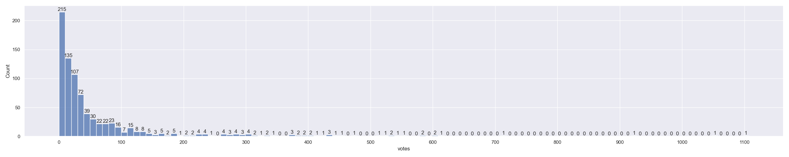
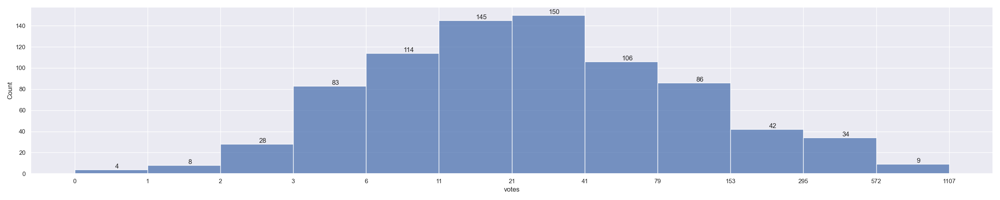
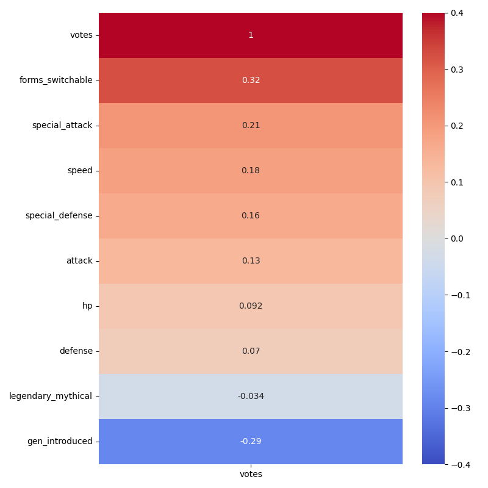

# Pokemon Popularity


## About
What makes a Pokemon popular? Let's dig in and see what we can find out. We will be looking at the video game series developed by Game Freak and published by Nintendo. This is my Capstone Project for Code:Louisville

Here are the Pokemon attributes we will be looking at to see how they correlate with their popularity:

- Stats
- Primary color
- Shape
- Generation introduced
- Legendary/Mythical

## Data Sources
CSVs:
- [Kaggle Complete Pokemon Data Set | complete-pokemon-set.csv](https://www.kaggle.com/datasets/kylekohnen/complete-pokemon-data-set)
- [Results from a survey on Reddit | Favourite_Pokemon_responses-Results.csv](https://docs.google.com/spreadsheets/d/1c16Wh4AawHGbTi3Eq1DGZQdM4FMUlJO1YwXJZ_ylRvg/edit#gid=557303698)

Bulbapedia was also a huge help as a resource to make sure data was complete and in writing some of the explanations for terminology.
https://bulbapedia.bulbagarden.net/wiki/Main_Page

## Installation
- First you need to have Python installed. This project was developed using Python 3.11.4. If you do not have Python you can download it from the [official Python website](https://www.python.org/downloads/).
- You will also need Git to clone this repository. If you don't have Git, you can download it from the [official Git website](https://git-scm.com/downloads).

You will then need to clone this repo. To do so, open Git Bash/Terminal and navigate to where you want the directory where you want the repo cloned to.

To clone, run the following command:

```
git clone https://github.com/LeeMerrow/Pokemon-Popularity
```
It is recommended to make a virtual enviroment to have all dependencies isolated from your system's Python enviroment.

##  Virutal Environment Instructions
1. After you have cloned the repo to your machine, navigate to the project 
folder in GitBash/Terminal.
1. Create a virtual environment in the project folder. 
1. Activate the virtual environment.
1. Install the required packages. 
1. When you are done working on the repo, deactivate the virtual environment.

Virtual Environment Commands
| Command | Linux/Mac | GitBash |
| ------- | --------- | ------- |
| Create | `python3 -m venv venv` | `python -m venv venv` |
| Activate | `source venv/bin/activate` | `source venv/Scripts/activate` |
| Install | `pip install -r requirements.txt` | `pip install -r requirements.txt` |
| Deactivate | `deactivate` | `deactivate` |

## Data Analysis Capstone Features List
Here are the features that I have used for this project

### 1. Loading data
Read two data files (CSV)
### 2. Clean and operate on the data while combining them
Clean data and perform a pandas merge on two values and calculate a mean value
### 3. Visualize / Present data
Make 3+ seaborn visualizations
### 4. Best practices: Enhance project to a higher tier
Utilize a virtual environment and inclued instructions in README file
### 5. Interpretation of data
Annotate in code and markdown cells in Jupyter Notebook, and README file

## Understanding Pokemon Terminology

### Generation
Pokemon games are usually refered to their generation or gen. This is just a simpler way to break down the games. The first set ofgames, Pokemon Red and Pokemon Blue, are gen 1. The second set of games, Pokemon Gold and Pokemon Silver, are gen 2 and so on. We will only be looking at the first 7 gens.

### Shapes
Each pokemon is assigned a 'shape'. This gives you a rought idea about how the pokemon looks in terms of features such as wings or silhouette. There are currently 14 shapes that a pokemon can be split into. They are as follows:

  Pokémon consisting of only a head

 

  Pokémon consisting of a head and legs

 

  Pokémon with fins

 

  Pokémon with an insectoid body

 

  Pokémon with a quadruped body

 

  Pokémon with two or more pairs of wings

 

  Pokémon consisting of multiple bodies

 

  Pokémon with tentacles or a multiped body

 

  Pokémon consisting of a head and a base

 

  Pokémon with a bipedal, tailed form

 

  Pokémon with a bipedal, tailless form

 

  Pokémon with a single pair of wings

 

  Pokémon with serpentine bodies

 

Pokémon consisting of a head and arms


### Legendary/Mythical
Legendary pokemon are pokemon that you can normally only catch once per game/save file. These are usually rare pokemon. There can be multiple different legendary pokemon in a generation, with there normally being between 3-9 different legendaries per gen, but sometimes more.

Mythical pokemon are even rarer. They are typically only handed out during events. Most you cannot catch thru normal gameplay and either need a code to unlock or some other means depending on when the game came out. There are normally fewer Mythical than legendary pokemon per gen, between 1-5.

### Stats
- Pokemon have many stats that determine how good they are at combat. Here is a simple breakdown of what each stat does:

##### HP
- HP determines how much damage a pokemon can receive before fainting

##### Attack
- Attack helps determine how much damage physical moves do

##### Defense
- Defense helps determine how much damage from physical moves is mitigated

##### Special Attack
- Attack helps determine how much damage special moves do

##### Special Defense
- Defense helps determine how much damage from special moves is mitigated

##### Speed
- Speed determines the order of pokemon that can act in battle. Since pokemon is turn-based game, usally the pokemon with the highest speed gets to attack first.

### Forms
Some pokemon can look and have different stats depending on their forms. Most pokemon do not have different forms. We will not be diving too much into this in our analysis, but we will be looking to see if they have different forms if that makes correlates with their popularity.

## Interpretation of data
So in the juyputer notebook I've cleaned up the data, merged and made new data to calculate the means according to characteristics, and then made a few different graphics to show the spread of votes per characteristics. Now lets look at our data and try to pull some info out of them.

### Distribution of votes

As we can see the data is very left-heavy, with 215 pokemon recieving less than 10 votes. The pokemon with the most votes, Charizard, has 1107 votes. Later on we will split the data to see if there is any differences for pokemon over 100 votes compared to under 100 votes. I also made a distribution on a logorithmic scale to get a better idea of the spread of votes.




### Heatmap
Let's look at the heatmap I made.


When we look at this the top of the list is forms_switchable at .32. This makes sense if we look at it from the developers point of view. They are more likely to give more attention and different forms to pokemon that are popular.

Next is special_attack at .21. Special attack being high could be showing that voters like pokemon that have move sets that are elemental based, since most elemental type moves are special and benefit the most from special attack

Third is speed at .18. This makes sense from a gameplay perspective why it would possibly be higher ranked. Pokemon with higher speed stats generally get to attack first, which can win you the battle. Also from a design standpoint, if a pokemon is fast it will usually look fast. Similar in a way that people like sport cars.

The rest of the stats have lower correlation with defense being the lowest. 

A pokemon being legendary or mythical seems to have no and a slight negative correlation. This could be due to the lower amount of legendary and mythical pokemon in comparison to all pokemon.

One thing I did not find surprising is that gen_introduced is negativlhy correlated with popularity. This makes sense when you consider that older pokemon, aka lower gen_introduced, may have been peoples first introduction to pokemon. This also makes sense because the survey was done on reddit, approximantly 70% of redditors are over 18, with half of that being over 30([source](https://passport-photo.online/blog/reddit-statistics/#0-top-10-reddit-stats-and-facts-to-know-in-2023)).

### Boxplot by characteristic
#### Full sample


Lets start with looking at color. For our overall samples size Yellow is on average more popular even though the most popular pokemon is Red and has almost double the votes as Yellows most popular pokemon. The 3 highest voted pokemon seem to be the exception when it come to color. The three most popular pokemon colors are; Red, Purple, and Brown; and they are on average in the middle of the pack in terms of popular colors.

Next plot is shape. The mean seems to follow the same order as the max for each category, with a few exceptions. The exceptions are Multi_Wing, Serpentine, and Legs. All three have a closer mean votes to max votes. Multi_Wing and Legs have under 20 pokemon each so that may be why they are outliers in the pattern. Serpentine appears to have a more even spread of votes with outliers that are not too extream. One interesting shape is Multi_Bodies, which top voted pokemon is almost 400 and the next is under 100. Multi_Bodies is also the rareist shape with only 15. Shape seems to be a good indicator to if a pokemon will be popular or not

Next is what generation the pokemon came out. The first two gens, which came out on the original Game Boy, are both the most popular. Gen 3 came out for the Game Boy Advance and seems to be less popular. This could be due to the Game Boy Advance sold only 81.51 million consoles when compared to the Game Boy/Game Boy Color sales of 118.69 million. Gen 4 has slightly better spread of votes when compared to Gen 3, but Gen 3 has more pokemon with over 200 votes. Gen 4 was also the first pokemon games out for the Nintendo DS which has 154.02 million consoles sold. Gen 5, 6, and 7 seem to be the least popular with similar spread.([source for sales numbers](https://vgsales.fandom.com/wiki/Best-selling_handheld_consoles))

The next image is the same data but with outliers removed.


#### Over 100 Votes


Now lets look at pokemon that recived over 100 votes. The first image shows the number of pokemon that recived over 100 votes, and the second shows a box plot to help us visual the spread of the data. While Blue is the most common color with over 100 votes, it is the 5th average votes for over 100 votes. This is likely due to the the top 3 pokemon helping to push the average for Red, Purple, and Brown.

For Shape we have a few odditys due to there only being 1 pokemon that had over 100 votes for Multi_Bodies, Head, and Tentacles. Multi_Wing really shows its high average, with only 4 pokemon reaching over 100 votes. Bipedal_Tail has the most representation of with 40 pokemon and Quadruped in second with just over 30. From looking at both the overall scope and just pokemon with over 100 votes, it seems the best shape to be popular are Bipedal_Tail, Quadruped, and Bipedal_Tailless.

For Generation we see almost the same story as when we were looking at the full scope. Some key difference is that Gen 3 keeps a good average for when it breaks 100 votes and Gen 5 has more pokemon than Gen 6 or 7, but votes are much closer to 100 

#### Under 100 Votes

Here we see all pokemon that recived under 100 votes. For color there the bottom 4 are Pink, Blue, Gray, and White at the lowest. Blue is overall 4th and has some high vote pokemon that help brings its overall average up, but it seems to be when it misses in terms of popular it doesn't do well. This could also be due to the fact that Blue is the most common color with 145 different pokemon. Pink is the second rarist color with only 47 and seems to place low no matter how we split the data. Gray and White are also low overall but White has a few that stand out.

For Shape the bottom 4 are Head, Arms, Tentacles, and Multi_Bodies. Head, Tentacles, and Multi_Bodies seem to struggle with popularity with all only reciving 1 pokemon with over 100 votes and there average under 100 is also low. Arms is middle of the pack overall, but have a fairly low vote spread

For Generation the bottom 3 are Gen 5, 6, and 7. This is just confirmation of what we have observed earlier.

#### Overall
So Shape and Generation seems to be the correlation the most with pokemon popularity. Color seems to have an effect, but to see of a degree.